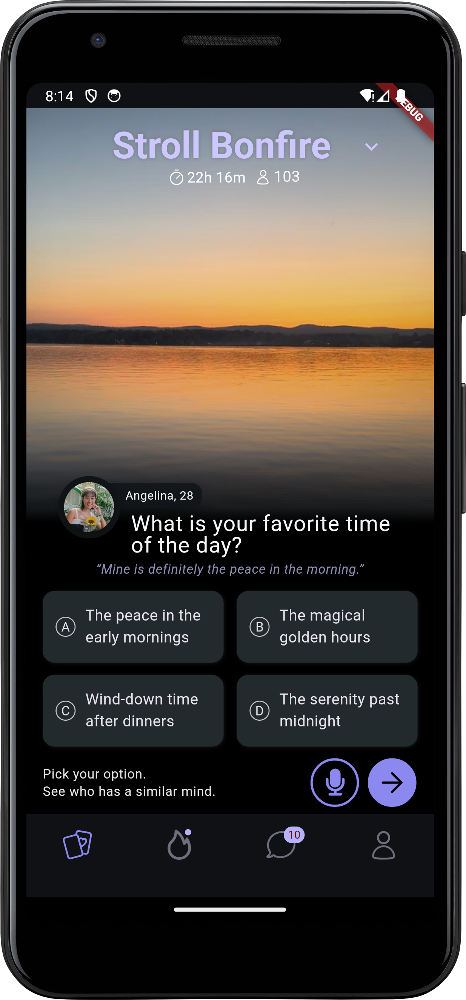

# stroll
Task Overview

Implemented the “Favorite Time of Day” question screen.

🔨 What Was Done
	•	Created a clean and intuitive UI matching the Stroll design system.
	• Built a responsive layout that works across screen sizes (flutter_screenutil).
  • Scrollable screen for small screen size phones.
	• Implemented selection highlighting (state-based UI for option selection).
	•	Added time-left and participant count indicators.
	•	Integrated placeholder for voice input (microphone button).
	•	Ensured accessibility and theme consistency (dark mode).

 Tech Stack
	•	Framework: Flutter
	•	Design Tools: Figma
 
Screenshot

